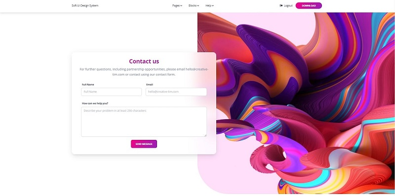

# Flask v2.0 Release

This page summarizes all updates provided by version 2.0 of Flask.

***

## Flask 2.0 highlights

> `Blueprints`

Starting with `2.0` version `Blueprints` can be nested under each other. This feature might improve the design of complex products.

> `Flask Shell`

Tab completion is now supported for all registered entities (variables, classes)

> `Config from file`

Re-add deprecated `Config.from_json`, which was accidentally removed early.

> `Improved CLI errors`

When an app could not be loaded, errors are displayed instantly when the development server is active.

> `FLASK_DEBUG` is deprecated

Replaced by FLASK\_ENV, a more current environment variable.

> `Language Detection`

**langdetect** package is used by default.

> `Improved Static files cache` - on development

Browsers will cache static files based on file content rather than a 12-hour refresh time frame.

## Free Starters upgraded to Flask 2.0

* [Flask Bootstrap 5 Volt](https://github.com/app-generator/flask-volt-dashboard) - `open-source` starter
* [Flask Datta Able](https://appseed.us/admin-dashboards/flask-datta-able) - `open-source` seed project
* [Flask Soft UI Design](https://appseed.us/product/flask-soft-ui-design-system) - Bootstrap 5 design

